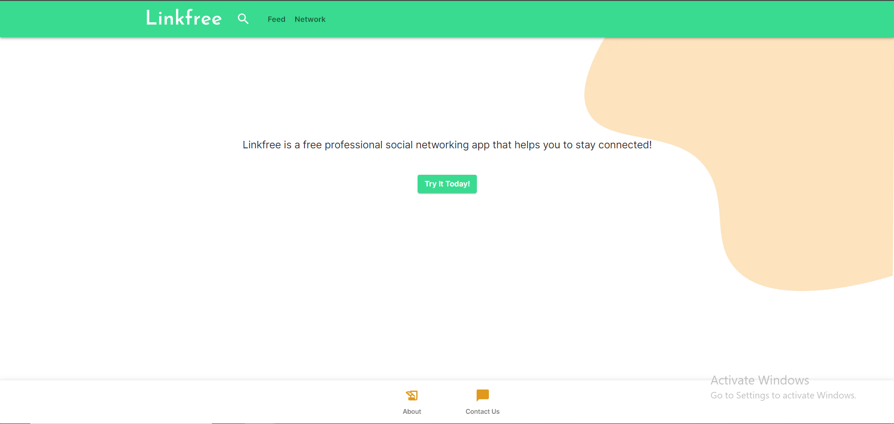
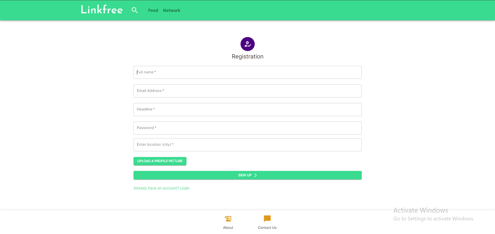

## About Linkfree

Linkfree is a social networking app alternative to Linkedin. Linkedin is premium, but Linkfree is free and has most functionalities of Linkedin.

### Table of contents

- [Overview](#overview)
  - [Linkfree advantages](#linkfree-advantages)
  - [Screenshots](#screenshots)
  - [Links](#links)
- [Stack](#stack)
- [Deployment](#deployment)
- [Author](#author)

### Overview

#### Linkfree advantages

Linkfree is a professional social networking app similar to Linkedin. However, it is free. It has basic functionalities of Linkedin and other functionalities can be added later on as needed. Functionalities are as below:
- Users can register and login.
- They can add all their professional information on their profile, such as their education, professional experiences, skills, interests and so on. 
- Users can also follow/unfollow other users on the network.
- They can share posts with network and like others' posts.

#### ScreenShots

#### Links
- [Live Site URL](http://13.43.110.103:3000/)

### Stack
- Built with
  - Next.js
  - Express.js
- External libraries
  - Bcrypt
  - Axios
  - Mui
  - Helmet
  - Dotenv
  - Jsonwebtoken
  - Multer
  - Rate-limiter
  - Xss-clean
  - So on.

### Deployment
Docker images are built locally and then deployed on AWS EC2 instance.
- Technologies used
  - Docker
  - AWS EC2

### Author

- Mehman Abdullayev
